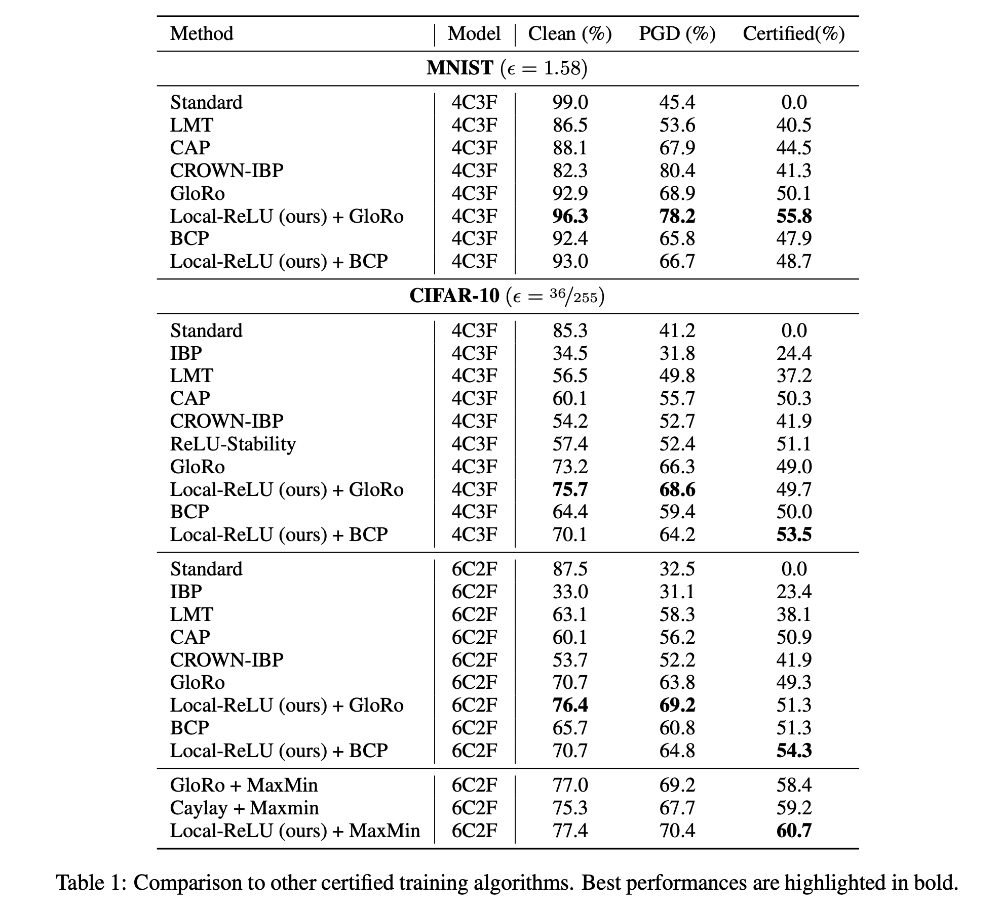

We provide our new experiment results in this webpage.

### More thorough comparisons to the baselines

We included the comparisons with the latest baselines with the MaxMin activation functions, and other differentiable training. Our method outperforms the baselines for both ReLU and Maxmin activation functions.

We also added in comparisons with ReLU-stability techniques. We use the best NN verifier in the very recent VNN COMP 2021, alpha-beta-CROWN [a] to verify the trained model with ReLU-stability loss. This approach produces a reasonably robust model when verified using a strong NN verifier. However, its clean, verified and PGD accuracy are worse than ours. 

In addition, we added another differentiable certified training algorithm: CROWN-IBP [b]. The performance gap between these models and our approach is quite big, indicating that our approach is more suitable for L2 norm certified robustness.

 

[a] alpha-beta-CROWN: https://github.com/huanzhang12/alpha-beta-CROWN

[b] Zhang, H., Chen, H., Xiao, C., Gowal, S., Stanforth, R., Li, B., ... & Hsieh, C. J.. Towards stable and efficient training of verifiably robust neural networks. ICLR 2020.

